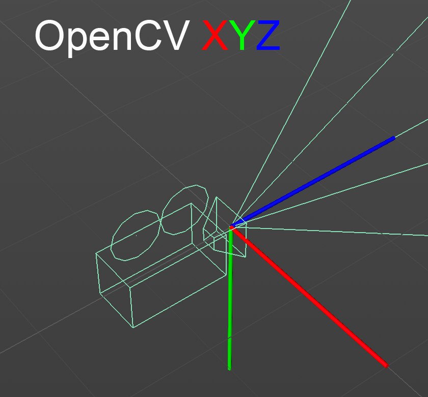
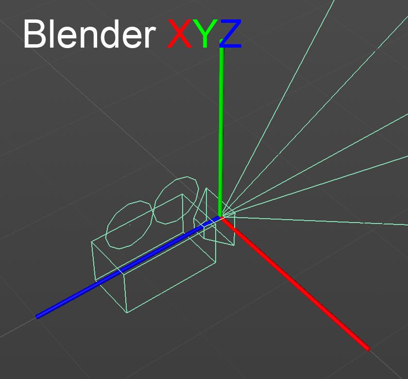

# 6.8300 Problem Set 1

## Getting Started

**Using Python 3.9 or newer,** create a virtual environment as follows:

```
python3 -m venv venv
source venv/bin/activate
```

Next, install PyTorch using the instructions [here](https://pytorch.org/get-started/locally/). Select pip as the installation method. **If you're on Linux and have a CUDA-capable GPU, select the latest CUDA version.** This will give you a command like this:

```
pip3 install torch torchvision torchaudio --index-url https://download.pytorch.org/whl/cu118
```

Finally, install this homework's other dependencies:

```
pip install -r requirements.txt
```

You can now open the project directory in VS Code. Within VS Code, open the command palette (<key>⌘ command</key> <key>⇧ shift</key> <key>P</key>), run `Python: Select Interpreter`, and choose the virtual environment you created in the previous steps.

For the best editing experience, install the following VS Code extensions:

* Python (`ms-python.python`)
* Pylance (`ms-python.vscode-pylance`)
* Black Formatter (`ms-python.black-formatter`)
* Ruff (`charliermarsh.ruff`)

## Project Components

Before getting started: if you're new to PyTorch or `einsum`, you can optionally check out [this Colab notebook](https://drive.google.com/file/d/19RAkdGtmwnM9DcAmx1dF2NgHskZ8i2vl/view?usp=sharing).

### Part 0: Introduction

This part doesn't involve programming. Just run the script using the provided VS Code launch configuration:

- Navigate to the debugger (<key>⌘ command</key> <key>⇧ shift</key> <key>D</key>).
- Select `Part 0: Introduction` from the drop-down menu.
- Click the green run button.

<!-- <details>
<summary>Running code directly from a command line (not recommended)</summary>
<br> -->

Remember to activate your virtual environment using `source venv/bin/activate` first. Then, run the following command:

```
python3 -m scripts.0_introduction
```

</details>

### Part 1: Point Cloud Projection

In this part, you'll have to fill out the following files:

- `src/geometry.py`
- `src/rendering.py`

Check your work by running:
```
python3 -m scripts.1_projection
```
This will write the rendered images to the directory `outputs/1_projection`.

#### Notes on Camera Formats

##### Extrinsics

In this class, camera extrinsics are represented as 4x4 matrices in OpenCV-style camera-to-world format. This means that matrix-vector multiplication between an extrinsics matrix and a point in camera space yields a point in world space.



##### Intrinsics

In this class, camera intrinsics are represented as 3x3 matrices that have been normalized via division by the image height $h$ and image width $w$.

$$
K = \begin{bmatrix}
    \frac{f_x}{w} & 0 & \frac{c_x}{w} \\
    0 & \frac{f_y}{h} & \frac{c_y}{h} \\
    0 & 0 & 1
\end{bmatrix}
$$

#### Notes on Type Checking

All of the functions in this homework are annotated with types. These are enforced at runtime using [jaxtyping](https://github.com/google/jaxtyping) and [beartype](https://github.com/beartype/beartype). If you're not familiar with `jaxtyping`, you should read the (short) [jaxtyping documentation](https://docs.kidger.site/jaxtyping/api/array/) to learn the tensor annotation format.

**Hint:** These annotations have important implications for broadcasting. If your code does not support the broadcasting implied by the annotations, you will not get full credit. See the note below for more details.

<details>
<summary>A note on the batch dimension annotations used in the homework.</summary>
<br>

The annotations `*batch` and `*#batch` are used for functions that can handle inputs with arbitrary batch dimensions. They differ in that `*#batch` states that batch dimensions can be broadcasted. For example:

```python
def broadcastable(a: Float[Tensor, "*#batch 4 4"], b: Float[Tensor, "*#batch 4"]) -> Float[Tensor, "*batch"]:
    ...

# This works, because the shapes (1, 2, 3, 1) and (2, 3, 5) can be broadcasted.
broadcastable(
    torch.randn((1, 2, 3, 1, 4, 4)),  # a
    torch.randn((2, 3, 5, 4)), # b
)

def not_broadcastable(a: Float[Tensor, "*batch 4 4"], b: Float[Tensor, "*batch 4"]):
    pass

# This doesn't work, since the shapes (1, 2, 3, 1) and (2, 3, 5) are not exactly the same.
not_broadcastable(
    torch.randn((1, 2, 3, 1, 4, 4)),  # a
    torch.randn((2, 3, 5, 4)), # b
)
```

All functions in `geometry.py` that have multiple parameters use `*#batch`, meaning that you must fill them out to handle broadcasting correctly. The functions `homogenize_points` and `homogenize_vectors` instead use `*batch`, since broadcasting doesn't apply when there's only one parameter. All functions return `*batch`, which means that outputs should have a fully broadcasted shape. In the example above, the output of `broadcastable` would have shape `(1, 2, 3, 5)`.

</details>


#### Running Tests

We've included some tests that you can use as a sanity check. These tests only test basic functionality—it's up to you to ensure that your code can handle more complex use cases (e.g. batch dimensions, corner cases). Run these tests from the project root directory as follows:

```
python -m pytest tests
```

You can also run the tests from inside VS Code's graphical interface. From the command palette (<key>⌘ command</key> <key>⇧ shift</key> <key>P</key>), run `Testing: Focus on Test Explorer View`.

### Part 2: Dataset Puzzle

In this part of the homework, you're given a synthetic computer vision dataset in which the camera format has not been documented. You must convert between this unknown format and the OpenCV format described in part 1. To do so, fill in the functions in `src/puzzle.py`.

Each student will receive a unique dataset with a randomly generated format. You can download your dataset from the Google Drive link below: 

https://drive.google.com/drive/folders/1itzqGUjAYbYSP2JH3sCX3yNVgesmcDn7?usp=drive_link

Please download the dataset corresponding to your Kerberos ID. If you can't find your ID, let us know via a Piazza message to the instructors and we will generate a dataset for you!

**Note:** Make sure to replace the `DATASET_PATH` with your dataset.

#### Dataset Format

Each dataset contains 32 images and a `metadata.json` file. The `metadata.json` file contains two keys:

* `intrinsics`: These intrinsics use the normalized format described in part 1.
* `extrinsics`: These extrinsics use a randomized format described below.

The extrinsics are either in camera-to-world format or world-to-camera format. The axes have been randomized, meaning that the camera look, up, and right vectors could be any of $(+x, -x, +y, -y, +z, -z)$. Note that this could yield a left-handed coordinate system! Here's an example of Blender's (right-handed) camera coordinate system:



#### Dataset Camera Arrangement

The cameras are arranged as described below. Use this information to help you figure out your camera format.

* The camera origins are always exactly 2 units from the origin.
* The world up vector is $+y$, and all cameras have $y \geq 0$.
* All camera look vectors point directly at the origin.
* All camera up vectors are pointed "up" in the world. In other words, the dot product between any camera up vector and $+y$ is positive.

Hint: How might one build a rotation matrix to convert between camera coordinate systems?

#### Checking Your Work

Check your work by running:
```
python3 -m scripts.2_puzzle
```
If your conversion function works correctly, you should be able to exactly reproduce the images in your dataset. If you want to test your `load_dataset` function in isolation, you can use the dataset located at `data/sample_dataset` with a `convert_dataset` that simply returns its input.

Note that you may use the mesh at `data/stanford_bunny.obj` if you find it helpful to do so, although using it is not required to find the solution.

### Part 3: Motion Magnification

In this part, you'll implement phase-based motion magnification in videos. 
Position shifts in image space correspond to phase shifts in the frequency domain of the Fourier transform. 
By comparing and amplifying these phase shifts between frames, we can exaggerate subtle motions in videos. 
To do so, fill in the functions in `src/magnify.py`.

#### Simple Motion (`magnify_change`)

For simple motions between two images, your implementation should:

* Compute the 2D Fourier transform of both images.
* Detect phase shifts by calculating the difference in phase.
* Magnify the phase shifts by a user-specified factor and reconstruct the image using the inverse FFT.

**Hint:** Recall Euler's formula: $\exp(i\theta) = \cos(\theta) + i\sin(\theta).$
This converts a phase (in radians) into a complex number, letting you combine magnitude and phase.

<details>
<summary>You can experiment with this concept:</summary>

```python
from numpy import angle, exp

# create a complex number
x = 1 + 1j
print(f"x = {x}")
print(f"Real = {x.real}, Imaginary = {x.imag}")

# magnitude and phase of complex number
mag = abs(x)
phase = angle(x)

print(f"Magnitude = {mag}")
print(f"Phase = {phase}")

# Euler's formula: reconstruct the complex number using magnitude and phase
y = mag * exp(phase * 1j)
print(f"y = {y}")
```
</details>

#### Multiple Motions 

##### Global (`magnify_motion_global_question`)
Given a test case with two moving points, predict where you would expect these points to appear after magnification.

##### Local (`magnify_motion_local`)
To handle multiple independent motions, your implementation should:

* Divide the image into overlapping local windows using Gaussian masks.
* Apply phase-based magnification to each window independently (by calling `magnify_change` on windowed portions).
* Aggregate results across all windows.

#### Video Motion Magnification (`magnify_motion_video`)

For video sequences, your implementation should:

* Process each RGB channel independently.
* Use spatial Gaussian masks to process local regions in each frame.
* Track phase changes over time by maintaining a moving average phase for each window.
* Magnify the phase shifts and update the moving average to ensure temporal consistency.

Helper functions are provided:

```python
process_phase_shift(current_phase, reference_phase)
update_moving_average(prev_average, new_value, alpha) 
```

**Hint:** Since the phase is periodic, ensure that computed phase shifts are constrained to the range [-π, π] before magnification.

#### Checking Your Work

Run the provided scripts for Part 3 to verify your implementation:

- **single_motion**  
  - Uses `magnify_change` on an image with a single impulse shift.  
  - Output is saved as `single_motion.png`.

- **multiple_motions_global**  
  - Uses `magnify_change` on an image with two different impulse shifts.  
  - **Note:** This reveals an artifact when handling multiple motions with a single global phase shift.  
  - Output is saved as `multiple_motions_global.png`.

- **multiple_motions_local**  
  - Uses `magnify_motion_local`on an image with two different impulse shifts.  
  - **Note:** This should handle both motions without producing the artifact seen in the global approach.  
  - Output is saved as `multiple_motions_local.png`.

- **motion_magnified_video**  
  - Uses `magnify_motion_video` on a video `bill.avi`.  
  - **Note:** The initial frames of the output video may show artifacts, which is expected behavior.
  - Output is saved as `bill_magnified.avi`.

You can check the behaviour of your functions by running: 

`python3 -m scripts.3_motion_magnification {tag}`

where you can replace the tag parameter with `single_motion`, `multiple_motions_global`, `multiple_motions_local` or `motion_magnified_video` to check your functions individually, or you can specify `all` to run all the tests. 

Output is saved to the directory `outputs/3_motion_magnification`.

### Part 4: Eulerian Motion Magnification

In this part, you will implement the predecessor of the phase-based motion magnification: Eulerian motion magnification.[^1]

[^1]: Hao-Yu Wu, Michael Rubinstein, Eugene Shih, John Guttag, Fredo Durand, and William T. Freeman. Eulerian video magnification for revealing subtle changes in the world. ACM Transactions on Graphics (Proc. SIGGRAPH 2012), 31(4), 2012

This method applies spatial decomposition and temporal filtering to magnify the subtle signals in the input video. The paper showed color magnification which could reveal color change due to the flow of blood as it fills the face, and also subtle motions like pulse on the wrist and moving abdomen of a baby as it breathes. 

To complete this section, please fill out the functions in `src/eulerian_motion.py`

#### Gaussian Pyramids (`create_gaussian_pyramid`)

This function should take the video frames as input and create 4 levels of the Gaussian pyramid. Add each level to a list so that the entire pyramid consists of one list. A plot of the first frame from each level of the pyramid can be found in `outputs/4_eulerian_motion/gaussian_pyramid.png`. Please submit this plot.

**Note:** The first level of the Gaussian pyramid should be the original video. 

#### Laplacian Pyramids (`create_laplacian_pyramid`)

This function takes in the Gaussian pyramid of the video and outputs a list containing the different levels of the Laplacian pyramid. A plot of the first frame from each level of the pyramid can be found in `outputs/4_eulerian_motion/laplacian_pyramid.png`. Please submit this plot.

**Note:** You will have only 3 levels for the Laplacian pyramid.

#### Temporal filtering (`butter_bandpass_filter` and `filter_laplacian_pyramid`)

We will perform temporal filtering on the Laplacian pyramid of the video. You will need to write the `butter_bandpass_filter` method which contructs the filter and filters the video. 

**Tips for writing butter_bandpass_filter**
  - Use `signal.butter` to create the bandpass filter (think about how to set the `axis` parameter).  
  - Use`signal.lfilter` to filter the video frames. 
**Note:** Please specify low and high frequencies in your filter as `0.4` and `3.0` repectively. 

Next use the `butter_bandpass_filter` function in `filter_laplacian_pyramid`. Apply the filter from `butter_bandpass_filter` to each of the levels of the Laplacian pyramid and then amplify the signal by an amplification factor of 20. Return the filtered Laplacian pyramid as a list as done so in the previous parts. 

Combine all the bandpassed filtered signals to one matrix which is the same dimensions as the input video. 

**Hint:** Start from the lowest resolution of the amplified filtered signal, upsample that using `cv2.pyrUp`, and add it to the amplified filtered signal at the next higher resolution.

#### Creating the Euler magnified video (`create_euler_magnified_video`)

In the `create_euler_magnified_video` function, combine all the bandpassed filtered signals to one matrix which is the same dimensions as the input video. **Hint:** Start from the lowest resolution of the amplified filtered signal, upsample that using cv2.pyrUp and add it to the amplified filtered signal at the next higher resolution.

To compute the final amplified video, loop over all the amplified filtered signals and add the sum of all to the original video. The output video, `euler_magnified_video`, will be the
input video frames + combined magnified signal.

#### Checking your work 

You can check the behaviour of your functions by running: 

`python3 -m scripts.4_eulerian_motion <tag>`

where you can replace the tag parameter with `create_gaussian_pyramid`, `create_laplacian_pyramid` or `create_euler_magnified_video` to check your functions individually, or you can specify `all` to run all the tests.

Output is saved to the directory `outputs/4_eulerian_motion`.

## Collaboration Policy

You may work with other students and use AI tools (e.g., ChatGPT, GitHub Copilot), but must submit code that you understand fully and have written yourself.

## Submission Policy

Double-check that you have not changed any of the function signatures in `geometry.py`, `puzzle.py`, `rendering.py`, `magnify.py` or `eulerian_motion.py`. Also, ensure the functions in `provided_code.py` are not changed. Submit to Gradescope.
