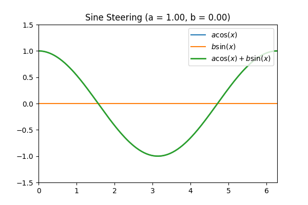
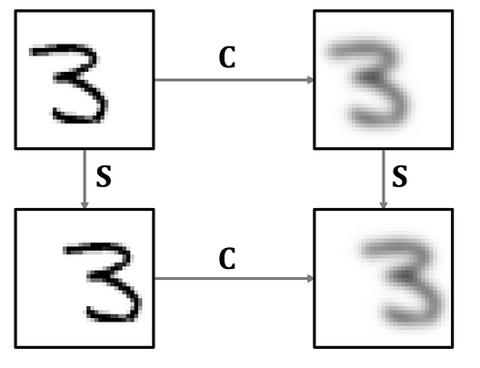
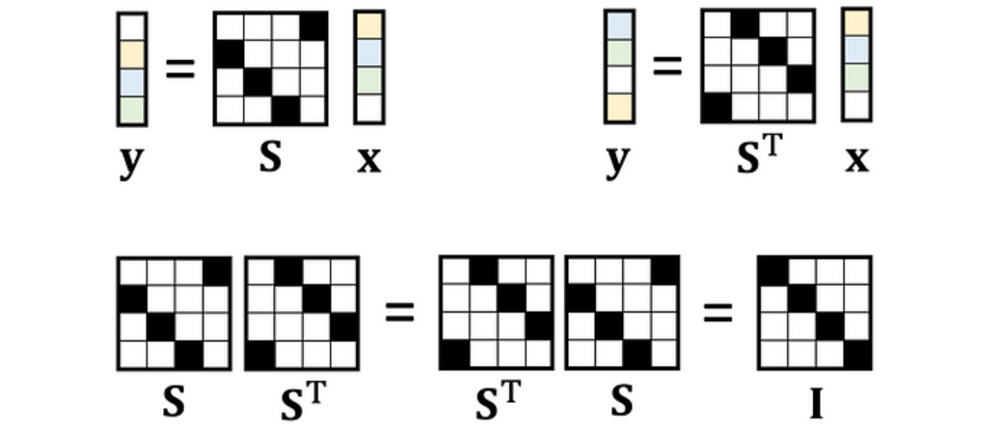
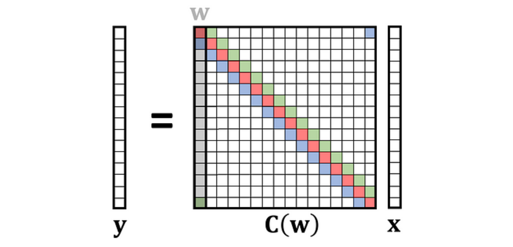
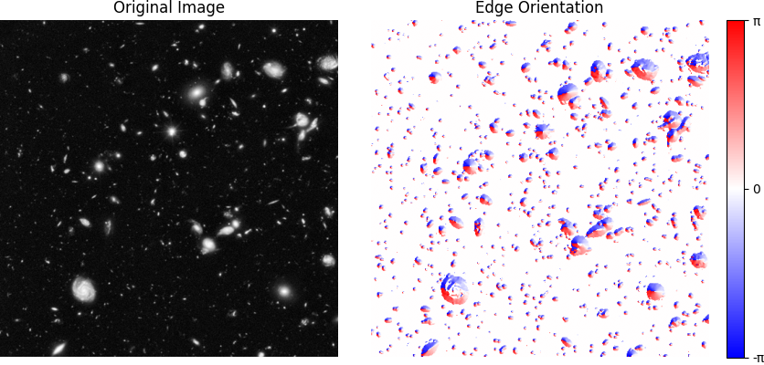

# 6.8300 Problem Set 2

> The Fourier Transform and Representation Theory

This homework will cover
* How to steer a sine wave
* How to derive the 2D Fourier Transform from first principles
* How to properly compute image derivatives
* How to orient convolutions in any direction with [steerable filters](https://people.csail.mit.edu/billf/publications/Design_and_Use_of_Steerable_Filters.pdf)

This problem set is organized as follows:
* `src/` contains the core functions you will need to implement and submit to Gradescope
* `outputs/` contains all other things you need to submit Gradescope
* `notebooks/` contains notebooks you can use to verify your implementations

At the end of the `README`, you will find the steps for setting up the python environment.

## Changelog
* **Feb 19, 2025:** 
  - Added a colorbar to the edge orientation filter output (*Part 3.5*)
  - Modified `README.md` file to clarify and move submission instructions up.
* **Feb 20, 2025:** Note that the eigenvectors returned by `torch` are [not unique and hardware-dependent](https://pytorch.org/docs/stable/generated/torch.linalg.eigh.html), so your eigenvectors might not match the notebook (*Part 2.3*).
* **Feb 22, 2025:** Added an extra visualization for `matrix_from_convolution_kernel` and `image_operator_from_sep_kernels` (*Part 2.2*).
* **Feb 24, 2025:** Update docstring for `src.steerable.conv` (*Part 3.4*).

## Submission Instructions

* Make sure to answer all short-answer questions in `outputs/proofs.md`. If you'd prefer to write up solutions in latex, feel free to place your solutions in `outputs/proofs.pdf`.
* If you collaborated with other students in this homework, please list their names in the same proofs file.
* If you answer the extra credit question (Part 2.6), write your answer in a jupyter notebook in `outputs/extra_credit.ipynb`.
* Zip your `src/` and `outputs/` directories.
* Upload the zip file to Gradescope.

## Part 1: Steerable Bases
> Steerable bases refer to a set of basis functions that can be linearly combined to produce a function in the same family, oriented (or phased) in any direction.

In this part, we consider the simplest case: 1D sinusoids. We will see that a sine and cosine of the same frequency form a steerable basis for sinusoids. Any linear combination of a sine and a cosine (of the same frequency) is just another sine wave of that same frequency, with a different phase shift. In other words, by adjusting the coefficients in front of $\sin(x)$ and $\cos(x)$, we are “steering” the phase of the resulting sine wave without changing its frequency.

### Part 1.1: Sine + Cosine = Sine
**(a)** Let's start by deriving the central identity for sine steering: Given basis functions $\sin(x)$ and $\cos(x)$, show algebraically that the linear combination $y(x)=a\cos(x)+b\sin(x)$ is a sinusoid of the same frequency. Additionally, derive the amplitude and phase shift of the resulting sinusoid in terms of $a$ and $b$.

**(b)** Show that picking $(a,b) \in \mathcal S^1$ (i.e., on the unit circle) results in a sine with unit norm. **Hint:** Use the inner product $\langle f, g \rangle = \frac{1}{\pi}\int_{-\pi}^{\pi} f(x)g(x) \mathrm dx$.

**Note:** We are looking for formal proofs in this Part.

### Part 1.2: Steer a sine!
**(a)** Complete the function `src.sine.coeffs_to_sine` that, given the coefficients $a$ and $b$, returns the sine from Part 1.1.

**(b)** Complete the function `src.sine.angle_to_coeffs` that, given an angle (in radians), returns the $a$ and $b$ coefficients in the unit circle.

**(c)** Generate a gif with `python scripts/sine_steering.py` that shows how the sine is steered by varying our coefficients. Once generated you should be able to see the animation below!



## Part 2: The Fourier Transform

> How does the Fourier Transform arise naturally from our image processing toolkit?

**Note**: Some of the graphics in this section are taken from [this blog post](https://medium.com/towards-data-science/deriving-convolution-from-first-principles-4ff124888028).

In Lecture 3, we discussed how images can be viewed as functions in an inner product space. As such, they can be represented as a linear combination of basis functions that span our image space. We saw two different bases:

* The pixel basis, where each basis function is the image with a single pixel set to 1 and all others to 0.
* The (real) Fourier basis, where each basis function is a sine or cosine wave of a certain frequency.

The upshot of being able to represent images in these bases is that different linear operators lend themselves to being more interpretable / easier to compute in different bases. In fact, in Lecture 4 we saw that we can derive the **Fourier Transform** as precisely the change of basis in the inner product space where operators that preserve translational symmetry in the image space are diagonalized.

An example of such an operator is the blurring convolution, as seen below:



So, intuitively, the Fourier basis is precisely the basis in which this blur (and the other shift-commutative operators) is easy to compute and interpret!

If you have encountered the Fourier Transform before (e.g., in a traditional signals course), the above characterization might not be immediately obvious, so let's take a look at how we arrive at this.

**Note**: As you complete the tasks in this part of the homework, you might find it useful to check your work using the provided notebook in `notebooks/fourier.ipynb`.

### Part 2.1: Torus Shifts

When applying our image processing operations on 2D images, we assume circular boundaries. For instance, when we shift an image horizontally or vertically, we expect the pixels that are "pushed outside the borders" to loop back around to the other side of the image.

Effectively, we are "glueing" the horizontal and vertical edges of the image together. Topologically, this corresponds to constructing a torus $T^2 = S^1\times S^1$, as seen below:


We also saw in Lecture how shifts applied as linear operators on a 1D signal with $n$ discrete entries take the form of a $n\times n$ permutation matrix that looks like a shifted identity:



**(a)** Using these facts, implement the function `src.fourier.shift_operator`, which extends this idea to 2D images. This function takes an image shape $(h,w)$ and how many pixels it should be shifted horizontally/vertically, and returns the linear operator corresponding to the shift that operates on a flattened image with circular boundary conditions (that is, a $hw\times hw$ matrix).

<details>
<summary>Hint</summary>

1. We can break down the 2D shift into two matrices (with shapes $h\times h$ and $w\times w$, respectively): a horizontal and a vertical shift. To construct these matrices, [torch.roll](https://pytorch.org/docs/stable/generated/torch.roll.html) may be useful.

2. Once we have both 1D shifts, obtaining the 2D shift is not as straightforward as multiplying them together... A useful perspective is that the horizontal (resp. vertical) shift must act on each row (resp. column) of the image. How would these actions be represented when the image is flattened? You might want to look at the definition and examples of the [Kronecker product](https://en.wikipedia.org/wiki/Kronecker_product) and its implementation in PyTorch: [torch.kron](https://pytorch.org/docs/main/generated/torch.kron.html).

</details>

### Part 2.2: Convolutions in the Torus

In our quest for the Fourier transform, the next step is to examine linear operators that commute with shifts, namely convolutions. In the one-dimensional case, we saw how convolving a kernel with a discrete signal of size $n$ corresponds to appplying a linear operator that takes the form of a $n\times n$ circulant matrix.



**(a)** Implement the function `src.fourier.matrix_from_convolution_kernel`, which constructs the circulant matrix of size $n\times n$ given a convolution kernel.
<details>
<summary>Hint</summary>

Each row of the matrix corresponds to the previous shifted one to the right.

</details>

**(b)** Similar to what we did with the shift operator in Part 2.1, we want to "lift" the convolution operator to act on our two-dimensional flattened images living on the torus. It turns out that, similar to how we can separate a 2D shift into a vertical and horizontal shift, we can often separate a 2D convolution filter into two 1D filters (see [separable filters](https://en.wikipedia.org/wiki/Separable_filter)).

Implement the function `src.fourier.image_operator_from_sep_kernels`, which returns the $hw\times hw$ matrix corresponding to the linear operator of the 2D convolution given by its separable components applied to the flattened image.
<details>
<summary>Hint</summary>

Your implementation should look pretty similar to `shift_operator` and should use `matrix_from_convolution_kernel`.

</details>

### Part 2.3: Spectral Analysis

**(a)** Implement `src.fourier.eigendecomposition`, which computes the eigenvalues and eigenvectors of a given self-adjoint linear operator. Importantly, your implementation should return the eigenvalues and eigenvectors in descending order of eigenvalues.

**(b)** Use the provided notebook to inspect the eigenvalues and eigenvectors of a 2D convolution operator. What do you notice? Why do they look different to the eigenfunctions in Lecture 4 (slides 67-68)? Write up 2-3 sentences detailing some insights that this reveals and how they relate to the Fourier transform. Additionally, why did we sort the eigenvalues in descending order (**hint:** think about implementations of the FFT in numpy/torch/etc.)?

**Note:** the eigenvectors returned by `torch` are [not unique and hardware-dependent](https://pytorch.org/docs/stable/generated/torch.linalg.eigh.html), so your eigenvectors might not match the notebook.

### Part 2.4: The Fourier Transform!

With the eigendecomposition of our operator, we can change the basis of any flattened image or linear operator to be expressed in terms of the eigenvectors of our operator. For our 2D convolution, this is precisely the 2D Fourier transform!

**(a)** Implement `src.fourier.fourier_transform`, which projects a flattened image to an eigenbasis.

**(b)** Implement `src.fourier.fourier_transform_operator`, which applies a change of basis defined by an eigenbasis to a given linear operator.

### Part 2.5: Operators in Fourier Space

**(a)** Run the provided code in the notebook to test your implementation for `src.fourier.fourier_transform_operator` on some linear operators. You should see that the operators are (block)-diagonalized. Why would this be expected/desired? Write 2-3 sentences.

**(b)** Implement `src.fourier.inv_fourier_transform`, which returns a flattened image projected onto an eigenbasis back to pixel space.

### Part 2.6: The Complex Fourier Transform (*extra credit*)

Can you convert the real-valued Fourier transform to a complex-valued Fourier transform? Recover the magnitude and phase.

## Part 3: Gaussian Filters

> In this section, we will discuss the best way to [compute image derivatives](https://en.wikipedia.org/wiki/Image_derivative).

To compute image derivatives, you may have previously seen various finite-differences approximations of the gradient (e.g., [Sobel filter](https://en.wikipedia.org/wiki/Sobel_operator)). However, [these filters have numerous problems](https://www.crisluengo.net/archives/22/). Chief amongst these issues is the preservation of high frequency noise, which makes the gradients output of these filters a very poor approximation of the image derivative. Here, you will derive and implement **Gaussian filters,** a highly accurate, exact (up to a smoothing), and efficient way to compute image derivatives.

To motivate Gaussian filters, let $I(x, y)$ be a 2D image and let $G(x, y)$ be a 2D Gaussian with mean $\mu = 0$ and isotropic variance $\sigma^2$. From [the properties of convolution](https://en.wikipedia.org/wiki/Convolution#Differentiation), we can see that 

$$
\frac{\mathrm d}{\mathrm d \mathbf x} (I * G) = \frac{\mathrm d}{\mathrm d \mathbf x} I * G = \frac{\mathrm d}{\mathrm d \mathbf x} G * I = G^{(1)} * I
$$

That is, *the convolution of the gradient of our image with a Gaussian* is equivalent to *the convolution of the derivative of a Gaussian with our image*!

Why is this exciting? **Because we can now compute the *exact derivative* of a blurred version of our image (Gaussian derivatives have closed-form formulas), instead of relying on finite differences.** This also let's us easily calculate higher-order image derivatives with $G^{(n)} * I$.

It's worth noting that you also have to smooth an image prior to applying a Sobel filter anyways (because [they amplify high-frequency noise](https://stackoverflow.com/questions/22022991/how-to-eliminate-the-noise-after-sobel-filtering)), so you really gain nothing by avoiding Gaussian filters :)

**Note:** As you complete the parts in this section, you can check your work using the provided notebook in `notebooks/gauss.ipynb`.

### Part 3.1: Implementing a 1D Gaussian filter

In this part, you will implement a 1D Gaussian filter with $n$-th order derivatives (`src.gaussian._gaussian_kernel_1d`).

Derivatives of Gaussian functions have [nice closed-form formulas](https://hannibunny.github.io/orbook/preprocessing/04gaussianDerivatives.html). However, since we sample finite-length Gaussian kernels for convolution, some numerical errors will creep in if we simply use the chain rule to get higher-order Gaussian filters. 

* Derive the response of $G^{(n)}$ to $f(x)=1$ for $n \geq 1$. What does this tell you the mean of your Gaussian kernel should be?
* Derive the response of $G^{(n)}$ to $f(x)=x^n$ for $n \geq 1$. What does this tell you the sum of your kernel, when multiplied by $x^n$, should be?

**Combine these facts to implement $n$-th order Gaussian filters with the correct mean and polynomial response in `src.gauss._gaussian_kernel_1d`.**

Some implementation details:
* You only need up to second-order derivatives for rest of this assignment, so feel free to hard-code these functions. Alternatively, [an interesting closed-form derivative formula](https://math.stackexchange.com/questions/4058298/closed-form-for-arbitrary-derivatives-of-gaussian-function) might be useful to you...
* Let the radius of the filter be $r=\mathrm{ceil}(\sigma t)$, where $t$ is the `truncation` hyperparameter. Note that this implies that the total length of the filter should be $2r + 1$.

### Part 3.2: Implementing a 2D Gaussian filter

Use the [separability of the 2D Gaussian filter](https://bartwronski.com/2020/02/03/separate-your-filters-svd-and-low-rank-approximation-of-image-filters/) to implement the following derivatives:
* $I_{X}$ (`src.filters.first_order_x`)
* $I_{Y}$ (`src.filters.first_order_y`)
* $I_{XY}$ (`src.filters.first_order_xy`)
* $I_{XX}$ (`src.filters.second_order_xx`)
* $I_{YY}$ (`src.filters.second_order_yy`)

### Part 3.3: Implementing the Laplacian of Gaussian (LoG) filter

The Laplacian operator is defined as

$$
\Delta = \frac{\partial^2}{\partial x^2} + \frac{\partial^2}{\partial y^2}
$$

When implemented using Gaussian filters, this operator is called the Laplacian of Gaussian (LoG). **Implement `src.filters.log`.**

### Part 3.4: Steerable Filters

> In this part, we will discuss [steerable filters](https://people.csail.mit.edu/billf/publications/Design_and_Use_of_Steerable_Filters.pdf), a method of computing filter responses at any orientation.

A steerable first-order Gaussian filter can be oriented at any angle using the formula

$$
G_{\theta}^{(1)} = G_{0°}^{(1)} \cos\theta + G_{90°}^{(1)} \sin\theta
$$

**(a)** Implement the following functions:
* A steerable first-order Gaussian filter (`src.steerable.oriented_filter`)
* A 2D function to convolve an image with a steerable filter (`src.steerable.conv`)
* A function to filter an image with a oriented filter (`src.steerable.steer_the_filter`)
* Instead of steering the function basis, start by constructing a filtered image basis and steer these images instead (`src.steerable.steer_the_images`)

**(b)** If you've implemented `src.steerable.steer_the_filter` and `src.steerable.steer_the_images` correctly, you should see that the outputs of both functions are the same. Write 2-3 sentences explaining why this is the case. 
* What does this tell you the relationship between rotations in the image space and the space of oriented filters?
* Does this tell you anything interesting about the relationship between the Fourier Transform and rotations?

### Part 3.5: Measure the orientation of angles in an image
As a slight twist, consider how you might extend these ideas to measure the orientation of edges in an image. In this more open-ended part, implement `src.steerable.measure_orientation`.

You should expect to see something like this:



**Hint:** consider the complex-valued filter

$$
G_{\theta}^{(1)} = G_{0°}^{(1)} + iG_{90°}^{(1)}
$$

**Note:** As this is a more open-ended question, we will grade based on the reasonableness of your approach. However, you are not allowed to ask the TAs for specific design suggestions for your algorithm.

## Getting Started

**Using Python 3.10 or newer,** create a virtual environment:

```
python3 -m venv venv
source venv/bin/activate
```

Next, install PyTorch using the instructions [here](https://pytorch.org/get-started/locally/). Select pip as the installation method. If you're on Linux and have a CUDA-capable GPU, feek free to select the latest CUDA version (although you can do this entire assignment on CPU). This will give you a command like this:

```
pip3 install torch torchvision --index-url https://download.pytorch.org/whl/cu126
```

Finally, install this homework's other dependencies:

```
pip3 install -r requirements.txt
```

You can now open the project directory in VS Code. Within VS Code, open the command palette (<key>⌘ command</key> <key>⇧ shift</key> <key>P</key>), run `Python: Select Interpreter`, and choose the virtual environment you created in the previous steps.

For the best editing experience, install the following VS Code extensions:

* Python (`ms-python.python`)
* Pylance (`ms-python.vscode-pylance`)
* Ruff (`charliermarsh.ruff`)
* Markdown Preview Enhanced (`shd101wyy.markdown-preview-enhanced`)
